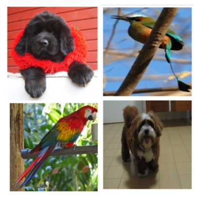
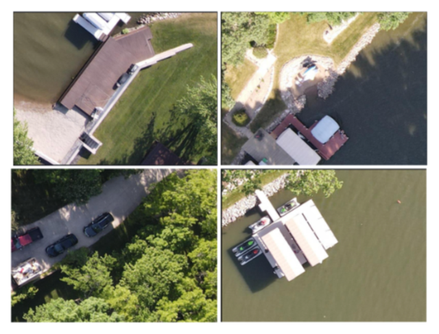
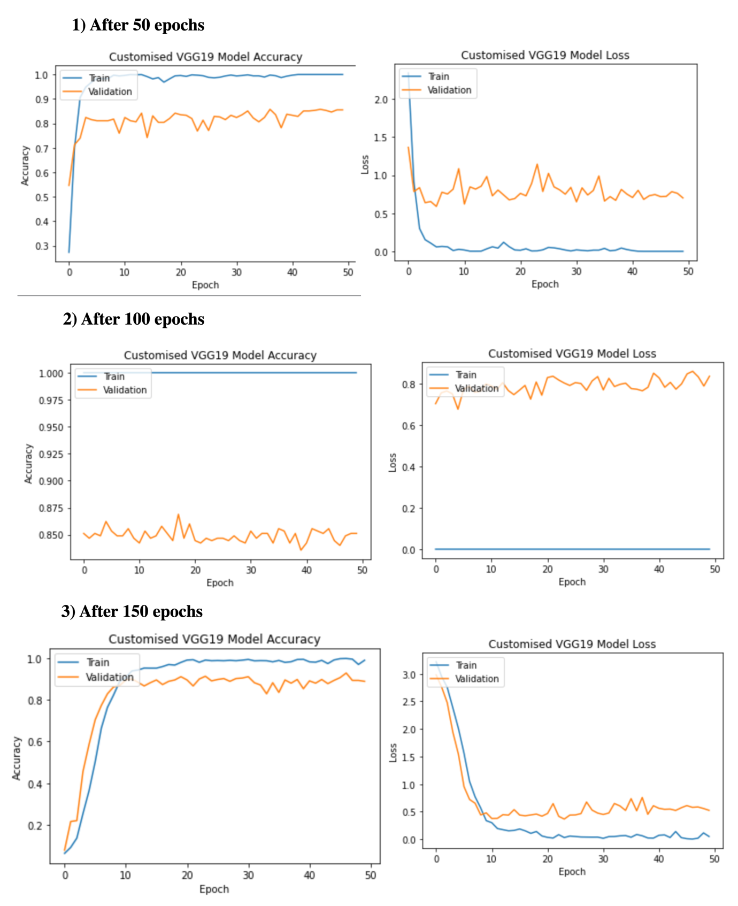
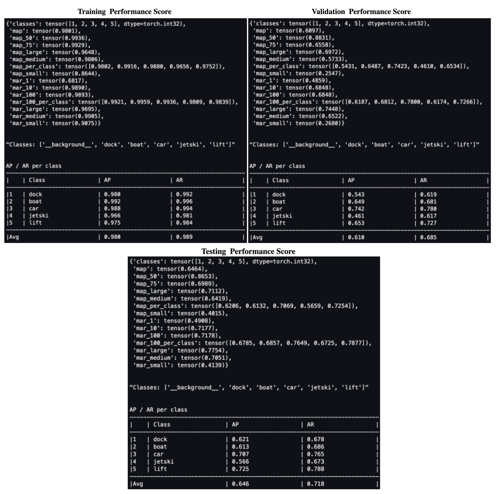
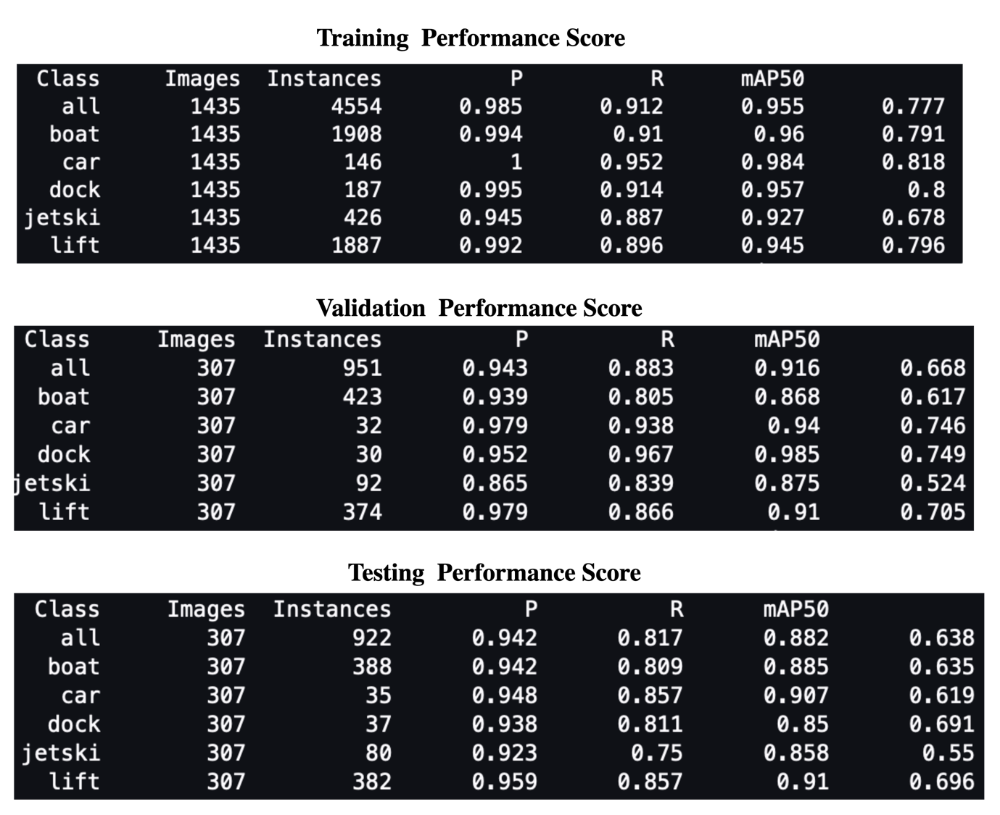
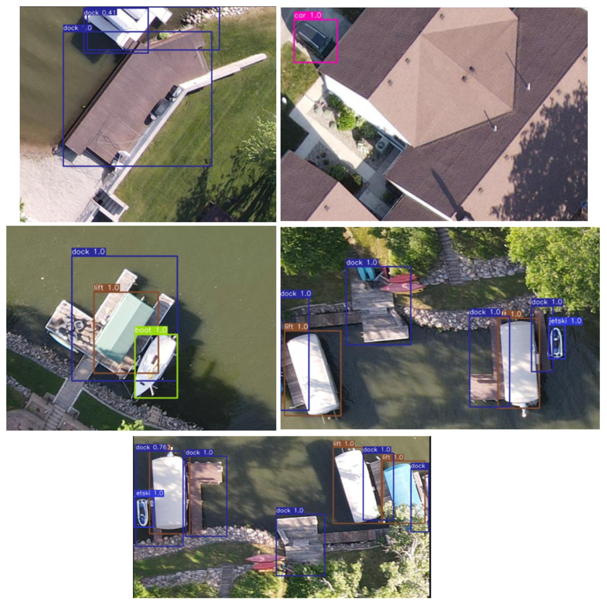
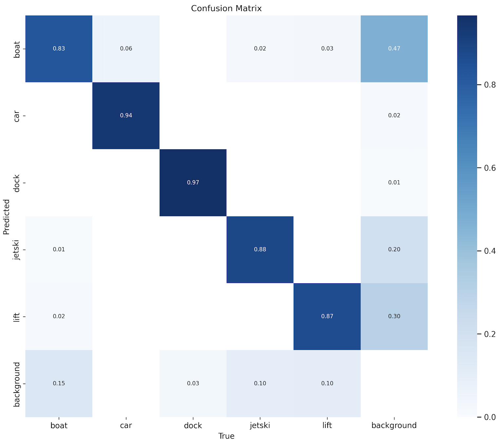
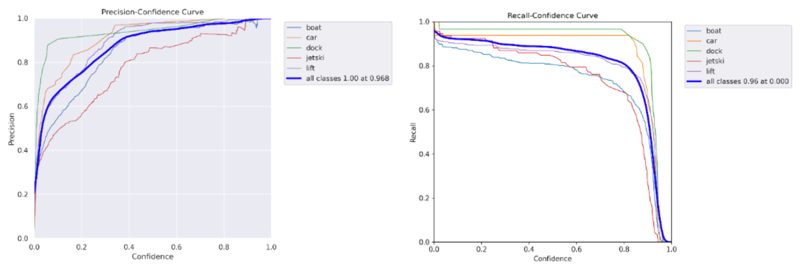
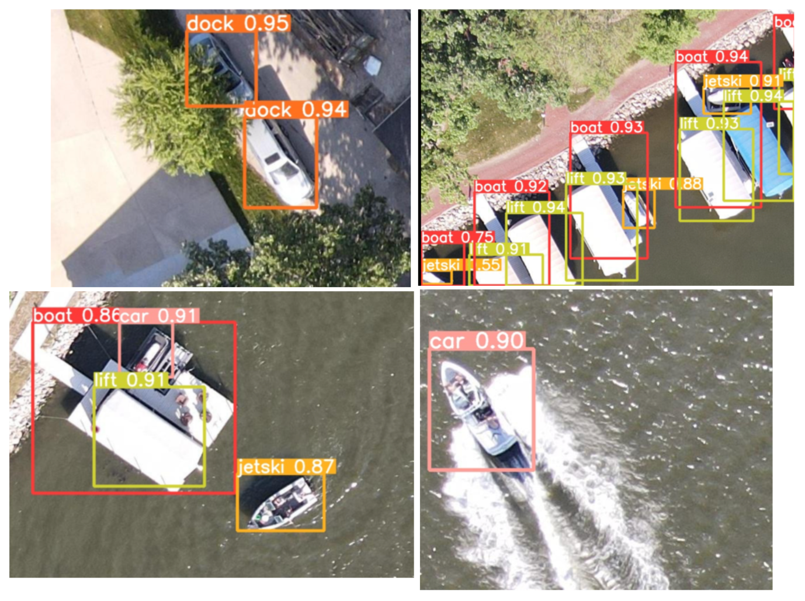
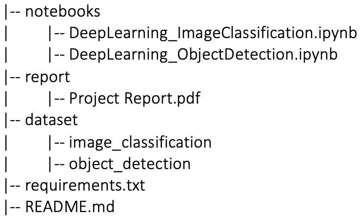

## **Fine-Tuned CNNs and Modern Architectures Approach for Accurate Image Classification and Object Detection**

### **<u>Project Overview</u>**

This project focuses on two primary tasks: image classification and
object detection, utilizing deep learning techniques. The aim is to
classify images into specific categories and detect objects within
images, localizing them with bounding boxes.

### **Tasks:**

1.  Image Classification:

    -   Classify images of dog breeds and bird species into one of 20
        categories.

    -   Utilize a VGG19 convolutional neural network (CNN) architecture
        with weights pre-trained on the ImageNet dataset.

2.  Object Detection:

    -   Detect and localize objects in aerial images across five
        categories: dock, boat, car, jetski, and lift.

    -   Employ Fast RCNN and YOLOv5 architectures for object detection.

### **<u>Datasets</u>**

**Image Classification Dataset**:

-   The dataset includes images of 20 different dog breeds and bird
    species, stored in separate directories corresponding to each
    category.

-   Example categories: Tibetan Mastiff, Turquoise Motmot, Newfoundland,
    Lhasa, Scarlet Macaw as shown in the below.

>  style="width:1.83168in;height:1.82761in" />
>
> A few images from the image classification dataset.

**Object Detection Dataset:**

-   The dataset comprises aerial images divided into five categories:
    dock, boat, car, jetski, and lift as shown below.

-   The images are pre-segregated into training, validation, and testing
    sets, stored in different formats: Pascal VOC XML, YOLO, and COCO
    JSON.

>  style="width:2.88763in;height:2.19802in" />
>
> A few images from the image classification dataset.

## <u>CNN Architectures</u>

**Image Classification:**

-   Baseline Model: Pre-trained VGG19 (excluding the top layer) with a
    custom fully connected layer.

    -   Input Layer: Accepts images of shape (256, 256, 3).

    -   Convolutional Blocks: 5 blocks, each with Conv2D followed by
        max-pooling layers.

    -   Fully Connected Layer: Flattened output from the convolutional
        blocks, followed by a 1024-unit dense layer and a 20-unit
        softmax output layer.

    -   Parameters: Total parameters – 53,600,340 (all trainable).

**Object Detection:**

-   **Fast RCNN**: Utilizes region proposal networks (RPN) to generate
    bounding boxes and classify objects within these regions.

-   **YOLOv5**: A real-time object detection system that divides the
    image into grids and predicts bounding boxes and class probabilities
    directly.

## <u>Model Summary</u>

Overall, the Fast RCNN model integrates region proposal generation and
object detection into a unified framework, making it suitable for
efficient object localization and classification tasks. While open
source YOLOv5 architecture available can be leveraged for object
detection and localization in images.

**Image Classification:** The table below provides information regarding
the configuration and parameters of the image classifiers CNN models.

<table>
<colgroup>
<col style="width: 26%" />
<col style="width: 33%" />
<col style="width: 39%" />
</colgroup>
<thead>
<tr>
<th><strong>CNN Architecture</strong></th>
<th><strong>Baseline VGG19 CNN Classifier model</strong></th>
<th><strong>Customised VGG19 CNN Classifier model</strong></th>
</tr>
</thead>
<tbody>
<tr>
<td>Weights</td>
<td>imagenet</td>
<td>imagenet</td>
</tr>
<tr>
<td>Include_Top</td>
<td>False</td>
<td>False</td>
</tr>
<tr>
<td>Image Generator</td>
<td>target_size = (256, 256), batch_size=50,
class_mode='categorical'</td>
<td>target_size = (256, 256), batch_size=50, class_mode='sparse'</td>
</tr>
<tr>
<td>Convolutional Layers</td>
<td>All 5 trainable</td>
<td>Only 4th block is frozen</td>
</tr>
<tr>
<td>Fully Connected Layer</td>
<td>1 dense layer with 1024 neurons with ReLu activation function and
final layer with 20 neurons</td>
<td>3 dense layer with (1025, 512, 256 neurons) with ReLu activation
function followed by dropout (with rate 0.5) and final layer with 20
neuron</td>
</tr>
<tr>
<td>Final Activation Function</td>
<td>softmax</td>
<td>softmax</td>
</tr>
<tr>
<td>Optimiser</td>
<td>Adam with learning rate 1e-4</td>
<td>Adam with learning rate scheduler function to update while
training</td>
</tr>
<tr>
<td>Loss</td>
<td>categorical_crossentropy</td>
<td style="text-align: center;">sparse_categorical_crossentropy</td>
</tr>
<tr>
<td>Metric</td>
<td>accuracy</td>
<td>accuracy</td>
</tr>
<tr>
<td>Epochs</td>
<td>200</td>
<td>150</td>
</tr>
<tr>
<td>Trainable Parameter</td>
<td>53,600,340</td>
<td>45,981,524</td>
</tr>
<tr>
<td>Non-trainable Parameter</td>
<td>0</td>
<td>8,259,584</td>
</tr>
</tbody>
</table>

**Object Detection:** The table below provides information regarding the
configuration and parameters of the object detection CNN models.

<table>
<colgroup>
<col style="width: 29%" />
<col style="width: 35%" />
<col style="width: 35%" />
</colgroup>
<thead>
<tr>
<th><strong>CNN Architecture</strong></th>
<th><strong>Fast RCNN model</strong></th>
<th><strong>YOLOv5 model</strong></th>
</tr>
</thead>
<tbody>
<tr>
<td>Backbone/Convolutional Layers</td>
<td>ResNet50</td>
<td>Standard convolutional layer</td>
</tr>
<tr>
<td>image_size</td>
<td>NA</td>
<td>416x416</td>
</tr>
<tr>
<td>batch_size</td>
<td>4</td>
<td>16</td>
</tr>
<tr>
<td>loss</td>
<td> </td>
<td> </td>
</tr>
<tr>
<td>metric</td>
<td>mAP (mean average precision)</td>
<td>mAP (mean average precision)</td>
</tr>
<tr>
<td>epochs</td>
<td>200</td>
<td>200</td>
</tr>
<tr>
<td>Trainable Parameters</td>
<td>43051309</td>
<td>7265882</td>
</tr>
<tr>
<td>Non-trainable Parameters</td>
<td>225344</td>
<td>0</td>
</tr>
</tbody>
</table>

### Experimental results:

**Image classification:** The below table presents the performance score
of the CNN classifiers.

<table>
<colgroup>
<col style="width: 22%" />
<col style="width: 35%" />
<col style="width: 41%" />
</colgroup>
<thead>
<tr>
<th><strong>Performance Scores</strong></th>
<th><strong>Baseline VGG19 CNN Classifier model</strong></th>
<th><strong>Customised VGG19 CNN Classifier model</strong></th>
</tr>
</thead>
<tbody>
<tr>
<td>Loss</td>
<td>Train: 2.4926 
Valid: 3.974 
Test: 3.2405</td>
<td>Train: 0.0504 
Valid: 0.5245 
Test: 0.5426</td>
</tr>
<tr>
<td>Accuracy</td>
<td>Train: 100% 
Valid: 63.06% 
Test: 68.78%</td>
<td>Train: 99.02% 
Valid: 88.89% 
Test: 89.39%</td>
</tr>
</tbody>
</table>

**Baseline**: The baseline VGG19 model's low training loss of 2.4926 and
100% accuracy on the training dataset indicate that the model
successfully learned the patterns and characteristics identified in the
training images of dog breeds and bird species. However, the validation
loss of 3.9743 and accuracy of 63.06%, and the testing loss of 3.2405
and accuracy of 68.78%, indicate that the baseline model performs much
worse on the validation and testing datasets than on the training
dataset, demonstrating significant overfitting.

Thus, additional investigation, such as adjusting the model
architecture, is required to address overfitting, accurately categorise
images of dog breeds and bird species on unseen data, and increase
generalisation performance.

**Customised**: The custom VGG19 CNN classifier model performed better
after 150 training epochs with a dropout rate of 0.5 to the fully
connected layer. The validation loss fell from 0.8367 to 0.5245,
demonstrating that the model's performance on validation data had
improved as well. Furthermore, validation accuracy grew from 85.11% to
88.89%, and testing accuracy of 89.39%, indicating that the model's
capacity to generalise on unseen data improved throughout training.

Figure 1: Graphs showing the performance score of the Customised VGG19
CNN model

Additionally, the customised model seems to have been considerably
stable with the utilisation of dropout after 100 epochs compared to the
initial 100 epochs, with no significant fluctuations in loss or accuracy
as illustrated in figure 1.

**Object Detection:**

1.  **Faster-RCNN Performance**

Figure 2: Performance score of the Fast RCNN CNN model

1.  **YOLOv5 Performance**

Figure 3: Performance score of the YOLOv5 CNN model

**Fast RCNN:** The model's mAP of 98.01%, 60.97% and 64.64% across all
classes on training, validation and testing respectively indicate the
moderate performance of the model in detecting and localizing objects
across all classes. The average precision score of each class differs
between datasets, which could be attributed to changes in dataset
properties such as image quality, object sizes, and congested levels.

Figure 4: Inference of the Fast RCNN on the testing images

Figure 4 demonstrates the Fast RCNN’s inference performed on the testing
images. The model identifies and localises objects well in the images,
with average precision for each class ranging from 56.66% to 72.5% and
mAP ranging from 56.59% to 72.54%.

**YOLOv5:** The overall mAP score declines from 77.7% in training, 66.8%
in validation, and 63.8% in testing, demonstrating a significant drop in
performance on unknown data. Notably, the jetski and car classes get the
lowest AP score of around 55% and 61% respectively on the testing,
indicating that the model struggles in detecting jetskis and cars.

Figure 5: Confusion matric, precision and recall graphs show the YOLOv5
model preforms well on training

Figure 6: Inference of the YOLOv5 on the testing images

Additionally, as illustrated in figure 6, the model has poor performance
in detecting cars, jetski, boats etc. The model misclassifies the jetski
as a car and the car as docks. This could be due to a variety of
factors, including the similarity of visual features or shapes amongst
different classes, the training model's inability to adequately cover
the diversity of jetskis, cars, and docks in diverse circumstances, and
an imbalanced distribution of classes in training data.

### **<u>Conclusion</u>**

The customised VGG19 CNN classifier model when fine-tuned by freezing
certain convolutional layers and employing dropout techniques
represented better performance and generalised capability as compared to
the baseline VGG19 model

When comparing the performance and inference of the Fast RCNN and YOLOv5
models, the former efficiently integrates region proposal generation and
object identification into a unified framework, making it suitable for
the application of object localisation and classification on an aerial
dataset with five classes. The YOLOv5 model shows potential for
robustness and generalisation improvement.

### **Prerequisites**

-   Python 3.7+

-   TensorFlow 2.x

-   Keras

-   OpenCV

-   Matplotlib

-   Jupyter Notebook

### **Repository Structure**

